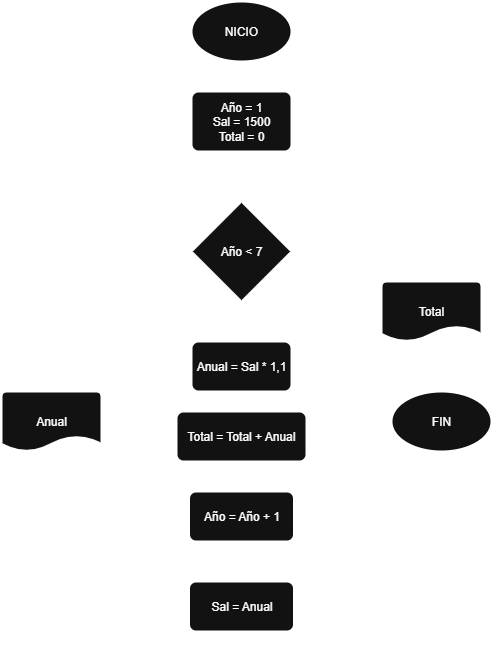
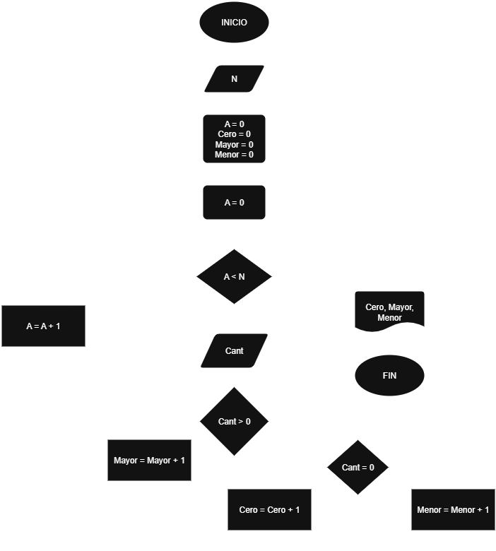

## Ejercicio 

Un profesor tiene un salario inicial de $1500, recibe un incremento de 10% anual durante 6 años. ¿Cúal es su salario al cabo de 6 años? ¿Qué salario ha recibido en cada uno de los 6 años? Realice el algoritmo y represente la solución mediante el diagrama de flujo y el pseudocódigo.
## Análisis

| Variables de entrada| Descripción |
|---------------------|-------------|
|  |  |

| Variable de salida | Descripción |
|--------------------|-------------|
| anual | Valor del salario cada año |
| total| Valor del salario los 6 años |

| Control | Descripción |
|------------|-------------|
| año |  |

## Pseucódigo

```
Inicio
Año = 1
Sal = 1500
Total = 0
Mientras año <= 6:
    Anual = Sal * 1,1
    Total = Total + Suma
    Sal = Anual
    Año = Año + 1
    Mostrar anual
Fin mientras

Mostrar Total

Fin
```



---
## Ejercicio 2

Se requiere un algoritomo para determinar, de N cantidades, cuántas son cero, cuántas son menores a cero, y cuántas son mayores a cero. Realice el diagrama de flujo y el pseudocódigo.

## Análisis

| Variables de entrada| Descripción |
|---------------------|-------------|
| N | Cantidades  |

| Variable de salida | Descripción |
|--------------------|-------------|
| Cero | Cuando un numero sea igual a 0 |
| Mayor| Cuando un numero en mayor que cero |
| Menor| Valor del salario los 6 años |

| Control | Descripción |
|------------|-------------|
| A |  |

## Pseucódigo

```
Inicio
Leer N
A = 0
Cero = 0
Mayor = 0
Menor = 0

Mientras A < N
    Leer Cant
    Si Cant > 0
        Mayor = MAyor + 1
    Si no
        Si Cant = 0
            Cero = Cero + 1
        Si no
            Menor = Menor + 1
    Fin Si
A = A + 1
Fin Mientras

Mostrar Cero , Mayor, Menor

FIN

```
