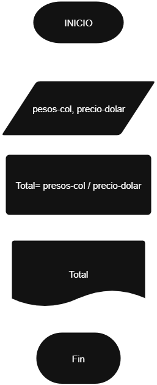

# **Ejercicio:**
Una empresa importadora desea determinar cuántos dólares puede adquirir con equis cantidad de dinero colombiano. Realice un diagrama de flujo y pseudocódigo que representen el algoritmo para tal fin.

## Pseudocódigo:

```
Inicio
Leer pesos-col, precio-dolar
Total= pesos-col / precio-dolar
Mostrar Total
Fin
```
## Diagrama de flujo:
