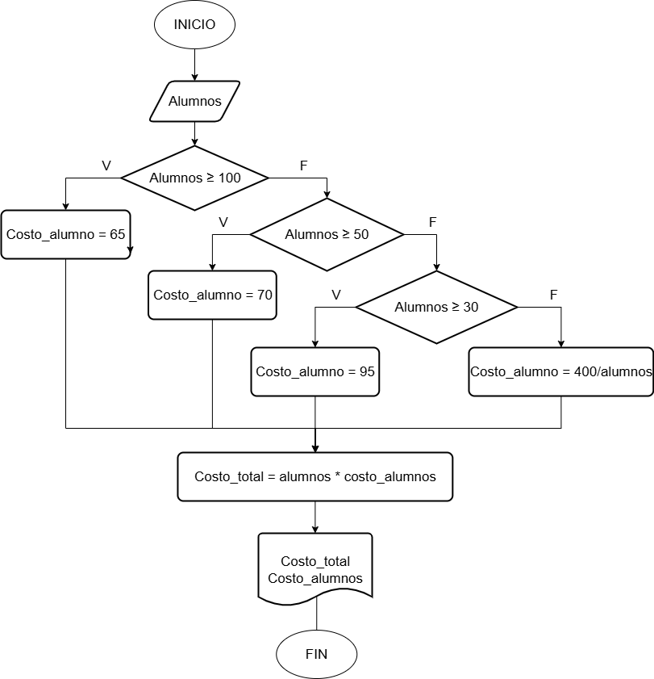

# Ejercicio 1
## Ejercicio:
Realice un algoritmo para determinar cuánto se debe pagar por equis cantidad de lápices considerando que si son 1000 o más el costo es de $85 cada uno; de lo contrario, el precio es de $90. Represéntelo con el pseudocódigo y el diagrama de flujo.

## Analisis

| Variables de entrada| Descripción |
|---------------------|-------------|
| Cant_lapices | Cuántos lapices se compran |

| Variable de salida | Descripción |
|--------------------|-------------|
| precio | Valor que hay que pagar |

| Variables intermedias | Descripción |
|--------------------|-------------|
| valor_unidad | Usada dentro del código |

| Constantes | Descripción |
|------------|-------------|
| 1000 | Cantidad límite de lápices |
| $85, $90 | Valor individual segun la cantidad |

## Pseucódigo

```
Inicio
Leer cant_lapices >= 1000
    valor_unidad = 85

Si no
    valor_unidad * cant_lapices
Escribir "Valor total: ", precio
Fin
```


---

# Ejercicio 2
## Ejercicio:
Un almacén de ropa tiene una promoción: por compras superiores a $250 000 se les aplicará un descuento de 15%, de caso contrario, sólo se aplicará un 8% de descuento. Realice un algoritmo para determinar el precio final que debe pagar una persona por comprar en dicho almacén y de cuánto es el descuento que obtendrá. Represéntelo mediante el pseudocódigo y el diagrama de flujo.

## Analisis

| Variables de entrada| Descripción |
|---------------------|-------------|
| valor_compra | Costo parcial de las prendas |

| Variable de salida | Descripción |
|--------------------|-------------|
| precio_final | Valor que hay que pagar |
| descuento | Valor del descuento |

| Constantes | Descripción |
|------------|-------------|
| 250000 | Valor a partir del cual se da el descuento |
| 15%, 8% | Descuentos |

## Pseucódigo

```
Inicio
Leer valor_compra
Si valor_compra > 250000
    descuento = valor_compra * 0.15

Si no
    descuento = valor_compra * 0.08
Fin Si
Precio_final = valor compra - descuento
Mostrar "Valor a pagar: $", precio final

FIN
```


--- 

# Ejercicio 3
## Ejercicio:
El director de una escuela está organizando un viaje de estudios, y requiere determinar cuánto debe cobrar a cada alumno y cuánto debe pagar a la compañía de viajes por el servicio. La forma de cobrar es la siguiente: si son 100 alumnos o más, el costo por cada alumno es de $65.00; de 50 a 99 alumnos, el costo es de $70.00, de 30 a 49, de $95.00, y si son menos de 30, el costo de la renta del autobús es de $4000.00, sin importar el número de alumnos.

## Análisis

| Variables de entrada| Descripción |
|---------------------|-------------|
| alumnos | cantidad de estudiantes |

| Variable de salida | Descripción |
|--------------------|-------------|
| costo_alumno | Valor que hay que pagar por estudiante |
| costo_total| Valor de lo que cuesta el viaje |

| Constantes | Descripción |
|------------|-------------|
| 4000 | Valor si son pocos alumnos |

## Pseucódigo

```
Inicio
Leer alumnos
Si alumnos >= 1000
    costo_alumno = 65

Si no
    Si alumnos >= 50
        costo_alumno = 70
    Si no
         Si alumnos >= 30
            costo_alumnos >= 95
        Si no
            costo_alumnos = 4000/alumnos
Fin Si
costo_total = alumnos * costo_alumnos
Mostrar "Costo total", costo_total
"Costo alumnos", costo_alumnos

FIN
```



---

# Ejercicio 4

## Ejercicio:
Una tienda de ropa tiene la siguiente promoción: por la compra de tres productos, la prenda con menor valor, tiene un descuento del 70% de descuento.
Cualcular cuál fue el descuento aplicado y cuánto tiene que pagar la persona.

## Análisis.
| Variables de entrada| Descripción |
|---------------------|-------------|
| precio_producto1 | Costo prenda 1 |
| precio_producto2 | Costo prenda 2 |
| precio_producto3 | Costo prenda 3 |

| Variable de salida | Descripción |
|--------------------|-------------|
| descuento | Valor del descuento |
| costo_total | Valor que debe pagar |

| Constantes | Descripción |
|------------|-------------|
| 70% | descuento |

## Pseucódigo

```
Inicio
Leer precio_producto1, precio_producto2, precio_producto3

Si precio_producto1 < precio_producto2 y precio_producto1 < precio_producto3
    descuento = precio_producto1 * 0.7
    costo_total = descuento + precio_producto2 + precio_producto3
Si no

    Si precio_producto2 < precio_producto3 y precio_producto2 < precio_producto1
    descuento = precio_producto2 * 0.7
    costo_total = descuento + precio_producto1 + precio_producto3
    Si no

Si precio_producto3 < precio_producto1 y precio_producto3 < precio_producto2
    descuento = precio_producto3 * 0.7
    costo_total = descuento + precio_producto1 + precio_producto2
    Si no
Fin si

Mostar "costo total:", costo_total
"descuento", descuento

FIN
```


