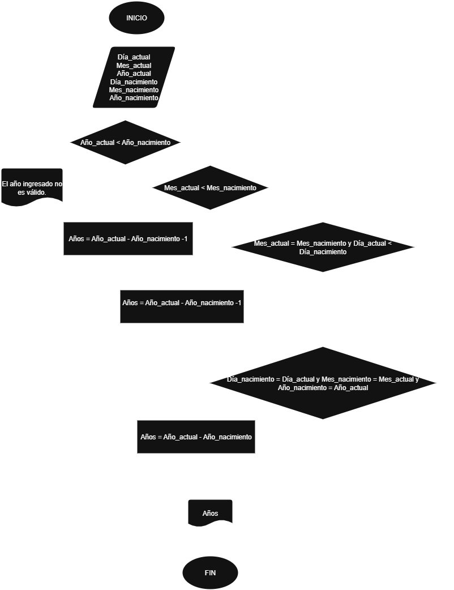

# Tarea de condicionales

Calcular los años de una persona con los siguientes datos:

Día, mes, año (de nacimiento), Día, mes, año (actuales)


## Analisis

| Variables de entrada| Descripción |
|---------------------|-------------|
| Día_actual | Día del año en el que estamos |
| Mes_actual | Mes del año en el que estamos |
| Año_actual |Año en el que estamos |
| Día_nacimiento | Día del año en el que nació la persona |
| Mes_nacimiento | Mes del año en el que nació la persona |
| Año_nacimiento | Año en el que nació la persona |

| Variable de salida | Descripción |
|--------------------|-------------|
| Años | Cuantos años tiene la persona |

## Pseucódigo

```
Inicio
Leer Día_actual
    Mes_actual
    Año_actual
    Día_nacimiento
    Mes_nacimiento
    Año_nacimiento

Si Año_actual < Año_nacimiento
    Escribir "El año ingresado no es valido"

Si no
    Si Mes_actual < Mes_nacimiento 
    Años = Año_actual - Año_nacimiento -1

    Si no
        Si Mes_actual = Mes_nacimiento y Día_actual < Día_nacimiento
        Años = Año_actual - Año_nacimiento -1

        Si no
            Si Día_nacimiento = Día_actual y Mes_nacimiento = Mes_actual y Año_nacimiento = Año_actual
            Años = Año_actual - Año_nacimiento

Fin Si

Mostrar "Años:" , Años

FIN
```
