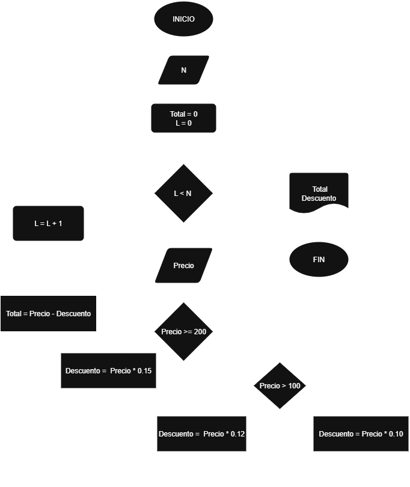

## Ejercicio 1

Realice el algoritmo para determinar cuánto pagará una persona que adquiere N artículos, los cuales están de promoción. Considere que si su precio es mayor o igual a $200 se le aplica un descuento de 15%, y si su precio es mayor a $100 pero menor a $200, el descuento es de 12%; de lo contrario, sólo se le aplica 10%. Se debe saber cuál es el costo y el descuento que tendrá cada uno de los artículos y finalmente cuánto se pagará por todos los artículos obtenidos. Represente la solución mediante el diagrama de flujo y el pseudocódigo.

### Analisis

| Variables de entrada| Descripción |
|---------------------|-------------|
| N | Cantidad de artículos  |

| Variable de salida | Descripción |
|--------------------|-------------|
| Costo | Costo de cada uno de los artículos |
| Descuento | Descuento de cada uno de los artículos |
| Total | Cuanto se pagará por todos los artículos |

| Control | Descripción |
|------------|-------------|
| L |  |

### Pseudocódigo

```
Inicio
Leer N
Total = 0

Mientras L > N
    Leer precio

    Si Precio >= 200 
            Descuento = Precio * 0.15
        Si no
            Si 200 > Precio > 100 
                Descuento = Precio * 0.12
            Si no
                Descuento = Precio * 0.10
    Fin si
    
    Total = Precio - Descuento
    L = L + 1
     Fin Mientras

    Mostrar Total, Descuento

    FIN
```



---

## Ejercicio 2

Tienen una tarjeta de $10.000.000. Calcular el valor de todas las cuotas sabiendo:
1. Valor de la compra
2. Tasa de interés del 2%
3. Número de cuotas. Máximo 36. 

### Análisis

| Variables de entrada| Descripción |
|---------------------|-------------|
|  |   |

| Variable de salida | Descripción |
|--------------------|-------------|
|  |  |
|  |  |
|  |  |

| Control | Descripción |
| Cuotas |  |
 